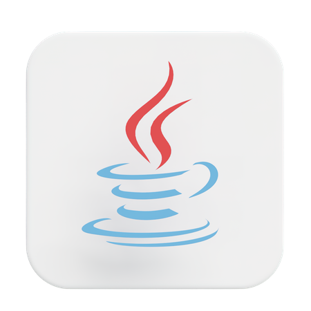
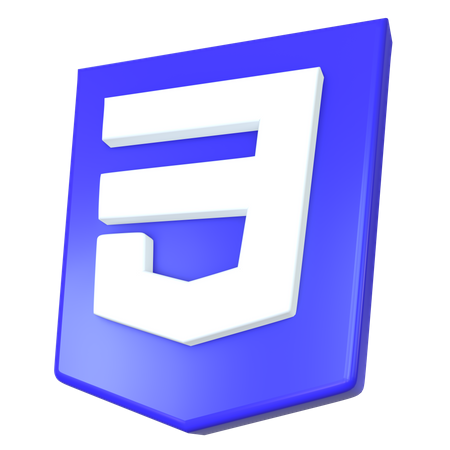
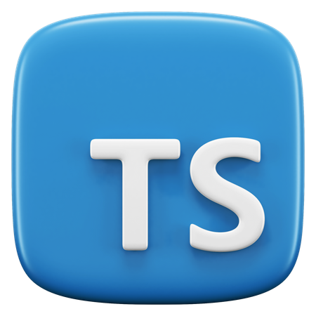

<h1 align="center"> 😄Hi I'm Rahul Alokkan </h1>
<h3 align="center"> Developer and Analyst | Computer Science Graduate | Tech Enthusiast</h3> 

---

   
  

- 🧑🏻‍💻 I’m a frontend Software Developer.
- 💻 I know Java and Web Developement.
- 🌐 I’m currently working on a small web-based applications.
- ⚡ I'm always either working on codes or playing games and watching sports.

## 🌐 Socials:
  

<!--      -->

# 💻 Tech Stack:
                               

# 📊 GitHub Stats:
 
 

### ✍️ Random Dev Quote

<!-- ## My Tech Stack
      -->

<!--

**Rahul-Alokkan/Rahul-Alokkan** is a ✨ _special_ ✨ repository because its `README.md` (this file) appears on your GitHub profile.

Here are some ideas to get you started:

- 🔭 I’m currently working on ...
- 🌱 I’m currently learning ...
- 👯 I’m looking to collaborate on ...
- 🤔 I’m looking for help with ...
- 💬 Ask me about ...
- 📫 How to reach me: ...
- 😄 Pronouns: ...
- ⚡ Fun fact: ...
-->
